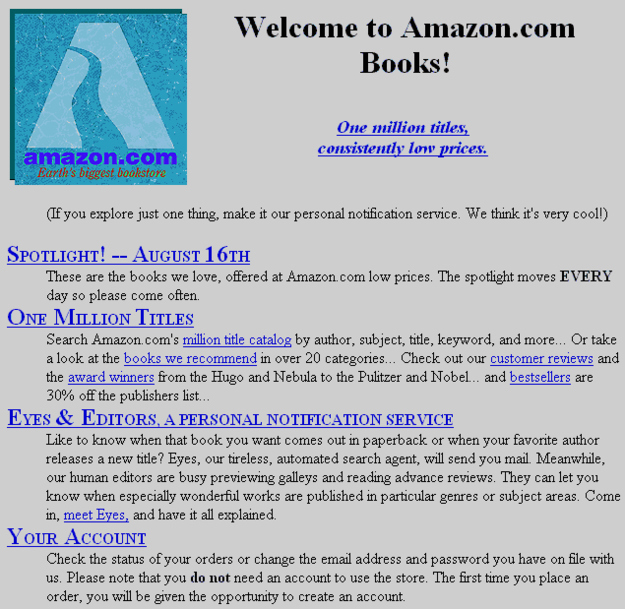
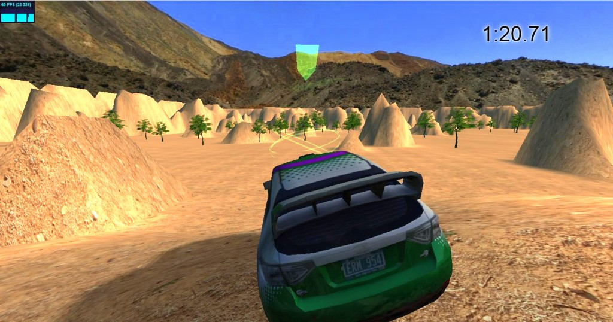

class: middle, center

# Introduction to Javascript
Imperial Cubesat, Software Engineering

---

# Goals
- **Part 1**: Web development 101
  - How does a webpage work?
  - What is HTML, CSS and Javascript
- **Part 2**: Introduction to Javascript
  - Basic syntax, writing functions.
  - Drawing on the HTML5 Canvas element

---
class: center

# How does a webpage work?

.half-slide.lfl.centered[
**Amazon 1995**

]
--
.half-slide.rfl.centered[
**Amazon 2015**

]

---

# How did a webpage work in 1995?

- A webpage is just a **static document** containing
formatted text, images and links to other webpages.
The contents of a webpage and how they should appear on the screen are described
in *HTML* and *CSS*.
--

  - A *client* requests a webpage from a *server* and maybe passes along
  some extra data using his web browser.
  This is done over *HTTP* (Hypertext Transfer Protocol).
  - The server generates the page depending on what the client sent,
  or just reads the webpage from a file.
  Then it trasmits the webpage back to client.
  - The client's web browser renders the webpage on the screen.
--

- The webpage is **completely static** in the sense that it does not change
after it has been loaded, can not interact with the user
or with external services.
--

- To achieve any kind of interactivity a new webpage must be requested
from the server each time the user wants for something to happen.
--

## .center.red[**Boring, not very useful!**]
---

### .left[Today:]

.half-slide.lfl[]
.half-slide.rfl[]
--

## .clear.center[Webpages are complete applications]
--
class: center

*Thanks to...*
--

# Javascript .red[❤]!

---

# How does a 2015 webpage work?
- **HTML**, or Hypertext Markup Language defines the contents of the page.
- **CSS**, or Cascading Style Sheet defines how these contents are displayed,
i.e. how the webpage looks.
- **Javascript** is a programming language that defines how the page behaves.
It interacts with the user, sends and receives data from a webserver,
modifies the HTML and CSS of the webpage and can even do things like 3D graphics.

.center[HTML and CSS are **.red[not]** programming languages.]

--

```html
<span class='centered'>
  HTML and CSS are <em>not</em> programming languages.
</span>
```

```css
.centered {
  text-align: center;
}

em {
  font-weight: bold;
  color: red;
}
```

---

# What is HTML?
* The standard markup language to create webpages, initially released in 1993.
* Is a series of HTLM elements consisting of tags, for example:
  * `<h1>CubeSat</h1>` - Header (title)
  * `` - an image
  * `<a href='https://cubesat.ic.ac.uk'>Imperial Cubesat</a>` - a link
* Good HTML defines content and gives meaning, but does not describe
how the webpage will look.
--

```html
<!DOCTYPE html>
<html>
<head>
  <title>Example HTML Page</title>
</head>
<body>
  <header class='main'>
    <h1>This is an example HTML page</h1>
  </header>
    <span class='acronym'>HTML</span> is <em>wonderful</em>.
    Here's a link to <a href='https://google.com'>google</a>
  </section>
</body>
</html>
```
---
# What is CSS?
* A stylesheet language introduced in 1995, used to define how
a webpage should look.
* Can be included directly in HTML `<style>` tags or referenced from an
external .css file
* Is a series of rules of the type *All header elements should be bold and red*

--

```css
h1 {
  font-style: Sans-serif;
  color: red;
  font-weight: bold;
}

*em.somestyleclass {
  font-style: italic;
  color: blue;
}
```

--

* We can specify IDs and classes for HTML elements, that we can then use
in stylesheets to define how they'll look.

```html
<em class='somestyleclass'> This will be italic and blue </em>
```

---

# What is Javascript?

* Javascript is a programming language introduced in 1995,
intended to be included in webpages. Javascript **can run inside the browser**
and all modern browsers support javascript.
* Like CSS, it can be included directly in an HTML `<script>` tag,
or referenced from a .js file.
* Dynamic, duck typing. Object-Oriented (well, almost).

--

```javascript
function isPrime(x) {
  for(var i=2;i<x;i++) {
    if(x % i == 0) return false;
  }
  return true;
}
console.log([1, 2, 3, 4, 5, 6, 7, 8, 9, 10].map(isPrime));
```
--

### What Javascript isn't:
* A clientside-only programming language. Javascript can also be used on the backend.
* .red[**Java**]. Java and javascript are completely unrelated.

---

class: middle, center
# Introduction to Javascript

---

# Primitive types, variables, operators

* Five primitive types: **Numbers** (3.14), **Booleans** (true/false), **Strings**
("CubeSat"), **null**, **undefined**
--

* Variables are declared with the `var` keyword.
```javascript
var someNumber = 2;
var aString = "Hello, world";
var mystery; //undefined
```
When no initial value is specied, a variable will have the value undefined.
--

* Common operators:
```javascript
var a = (2 + 3) * 8.00 / 2; // 20
var b = "Hello, " + "world."; // "Hello, world"
var c = (12 <= 8) || (3.8 < 4) && true; // true
var d = "42" == 42; // true - == does not care about types
var e = "42" === 42; // false - === compares both value & type
```
Unless you really know what you're doing, always use `===` for comparison.
---
# Type conversions
* **Dynamic typing** - variables can change types, and we don't need to state their type when declaring them:
```javascript
var answer = 42;
// Some code, and then:
answer = "The answer to life, the universe and everything";
```
--
* Javascript does **type conversions** automatically:
```javascript
var lyrics = "I got " + 99 + " problems";
```
--
Be .red[**very careful**]:
```javascript
var x = ("100" - 5) + 5;
var y = ("100" + 5) - 5;
```
--
Here x will evaluate to 100, y will evaluate to 1000.
That's because **+** is both the addition and concatenation operator.

---
# Conditionals and loops
* **If** conditionals, **for** and **while** loops are very similar to other languages:

```javascript
var x = 42;
for(var i=2;i<x;i++) {
  if((x % i) === 0) { // % is the modulo operator
    console.log(i + " divides " + x + "."); // console.log prints to the console
  } else {
    console.log(i + " does not divide " + x + ".");
  }
}
```
* Javascript also has do-while, for-of, try-catch, switch statements and the
break and continue keywords behave as expected.
* There is no *block scope* in javascript (i.e. Variables defined
inside a while loop will be accessible throughout the function)

---
# Arrays

* Arrays in javascript are zero-indexed, do not have a fixed length and can
contain elements of different types (because of dynamic typing). 

```javascript
var myArray = ['one', 2, 3.14];
myArray.push('(fantastic) four'); //Adds to the end of the array
myArray.push([5, 6, 7]); // Pushes the entire array as a single element
for(var i = 0; i < myArray.length; i++) {
  if(typeof myArray[i] === "string") console.log(myArray[i]);
}
```

* Other notable array methods include `.pop()`, `.reverse()`, `.shift()`, `.unshift()`,
`sort()`, `.splice()`, `.concat()`, `.join()`, `.slice()`, `.indexOf()` and many others.

---
# Objects

* **Objects** are unordered collections of name-value pairs called properties.
* Along with functions,
objects are one of the most fundamental parts of javascript.

```jabascript
var satellite = {
  position: {
    x: 45.2,
    y: 21.52
  },
  name: "Imperial CubeSat",
  hasCrashed: false, // Not yet
  images: [
    {time: 1634, path: "/images/one.jpg"},
    {time: 2312, path: "/images/two.jpg"}
  ]
};

console.log(satellite.name); // Access the 'name' member of the object
console.log(satellite["hasCrashed"]); // Works like an associative array too! 
console.log(satellite.position["x"]); // or satellite.position.x

satellite.images.push({time: 2314, path: "/images/three.jpg"});
satellite.hasCrashed = true; // :O
```
--

We'll take a closer look at objects later.

---
# Functions .small[(or *where things start to get interesting*)]

* Function definitions in javascript aren't all that different from other languages:
* Arguments are always optional (i.e. no "not enough arguments passed" errors),
and can be of any type so **be careful**.

```javascript
function square(num) {
  return num * num;
}
console.log(square(8)); // Yep, it's 64
console.log(square(2, 3, 4)); // It's not error, the 2 is passed as the argument
console.log(square()); // Not even that is an error! Returns NaN.
```


---

# Functions .small[(or *where things start to get interesting*)]

* Variables defined inside a function are local, i.e. won't be accessible from
outside the function (unless you forget the `var` keyword).
* Primitive types are passed by value. If a function changes a property
of an object, the change will be visible outside the function.

```javascript
var satellitesInOrbit = 9001;

function destroy(satellite, message) {
  var localVar = "secret!";
  satellite.hasCrashed = true;
  satellitesInOrbit--;
  message = "Kaboom";
}

var icyCube = {hasCrashed: false, type: "Cubesat"}, msg = "Happy Little Cubesat";
destroy(icyCube, msg);

console.log(icyCube.hasCrashed); // true - changed by the function
console.log(msg); // "Happy Little Cubesat" - not changed by the function
console.log(satellitesInOrbit); // 9000 - changed by the function
console.log(localVar); // ReferenceError - is only accessible inside destroy
```

---

# Functions .small[(or *where things start to get interesting*)]

**Functions in javascript are first-class citizens**.
They can be assigned to variables and object members and passed
as arguments to functions.

```javascript
var square = function (x) {
  return x * x;
}

applyToEach = function (array, f) {
  for(var i = 0; i < array.length; i++) {
    array[i] = f(array[i]);
  }
  return array;
}

console.log(applyToEach([2, 8, 100], square)); // [4, 64, 1000]
console.log(applyToEach([2, 8, 100],
    function (x) { return x * 2; })
  ); // [4, 16, 200]
```

--

`applyToEach` is basically an implemetation of Array.map():
```javascript
console.log([2, 8, 100].map(square));
```
Arrays also support functions like `.sort()`, `.filter()`, `.forEach()` which take other functions as arguments.

---
# More about objects

* Almost **everything in javascript is an object**: Numbers, strings, arrays, even booleans.
--

* Another way to create an object is by using a **constructor function**.

```javascript
function Satellite(name, hasCrashed, position) {
  this.name = name;
  this.hasCrashed = hasCrashed;
  this.position = position;
  this.moveRight = function() { this.position.x++; };
}

var ourSat = new Satellite("IcyCube", false, {x: 0, y: 0});
var uclSat = new Satellite("UglyCube", false, {x: 0, y: 0});

ourSat.moveRight();
console.log(ourSat.position.x); // 1
console.log(uclSat.position.x); // 0
```

The moveRight function above *is assigned to an object's property* and
is therefore called an *object method*. It can modify other properties of the
object by using the `this` keyword.

In the example above, *Satellite* is essentially an **object type**.
(similar to a class)
---

# More about objects

We can extend object types (i.e. add properties to all objects of
this object type). by using the special **prototype property**
on the object type.

```javascript
function Satellite(name, hasCrashed, position) {
  this.name = name;
  this.hasCrashed = hasCrashed;
  this.position = position;
  this.moveRight = function() { this.position.x++; };
}

var ourSat = new Satellite("IcyCube", false, {x: 0, y: 0});
ourSat.moveLeft(); // Error: "undefined is not a function"
*Satellite.prototype.moveLeft = function() { this.position.x--; }
ourSat.moveLeft(); // Now it works - and we didn't have to create a new object

console.log(ourSat.position.x); // -1
```

--

This allows us to do much of what we can do with object oriented languages.

---
# Summarizing Objects
* A **javascript object** is a **self contained entity** with its own properties.
* **Object properties can also be functions**.
The properties are then called **methods**.
* An object can also be created by using the `new` operator on
a **constructor function**.
* Constructor functions are regular functions that usually use
the `this` keyword to assign properties to the objects they will create.
Essentially, they act as **object types**.
* **Properties can be added to all objects of a certain kind** by using the
special `.prototype` property on the constructor function.
* There is no way to implement inheritance or private/protected/public members
in Javascript. All properties are always public.

---

# Type detection and duck typing

* We can use the `typeof` operator to **check the type of an object**.
```javascript
console.log(typeof 23.2); // "number"
console.log(typeof "CubeSat"); // "string"
console.log(typeof undefined); // "undefined"
console.log(typeof {name: "Anna"}); // "object"
console.log(typeof null); // "object" - is a bug kept for compatibility
```
* `typeof` **can only distinguish primitive types**
and can not distinguish between different types of objects.
* **Duck typing**: If it walks, swims and quacks like a duck, it's a duck.
We can check if the properties of an object are what we expect them to be,
but there's no need to check if an object is of a certain type.

---

# HTML5 Canvas

* The HTML5 `<canvas>` element is a container for drawing graphics: a rectangular area we can draw on.
* To draw on a canvas, we first need to incude in the HTML:
```html
<canvas id="screen" width="400" height="400">
</canvas>
```
* We can then draw on the canvas with Javascript:
```javascript
var canvas = document.getElementById("screen");
var context = canvas.getContext("2d"); // returns a CanvasRenderingContext2D
context.fillStyle = "#3399FF";
context.fillRect(5, 5, 10, 10);
```
---
class: middle, center

# Example
---

```javascript
function Vector2(x, y) {
  this.x = x;
  this.y = y;
  this.multiplyScalar = function (lambda) {
    this.x *= lambda;
    this.y *= lambda;
    return this;
  }
  this.add = function(other) {
    this.x += other.x;
    this.y += other.y;
    return this;
  }
  this.clone = function() {
    return new Vector2(x, y);
  }
}
```
---

```javascript
function Satellite(name, position, velocity) {
  this.name = name;
  this.position = position;
  this.velocity = velocity;
  this.draw = function (context) {
    context.fillRect(this.position.x - 5, this.position.y - 5,
      10, 10);
  }
  this.update = function (delta) {
    this.position.add(
      this.velocity.clone.multiplyScalar(delta)
    );
  }
}

cubesat = new Satellite("CubeSat",
  new Vector2(50, 50), new Vector2(10, -5));

function clearScreen(context) {
  context.clearRect(0, 0, 400, 400);
}

function cycle(context) {
  cubesat.update();
  clearScreen(context);
  cubesat.draw(context);
}

setInterval(cycle, 30);
```

---

# Javascript resources
* MDN: https://developer.mozilla.org/
--

* MDN: https://developer.mozilla.org/
--

* MDN: https://developer.mozilla.org/

--

### .center[That's all you'll ever need.]

--

# .center[Thank you :)!]
